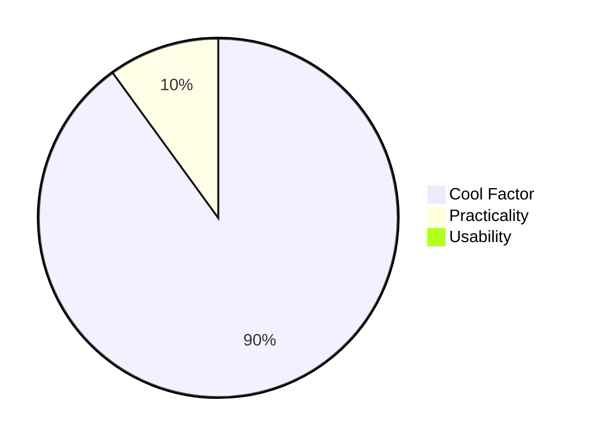
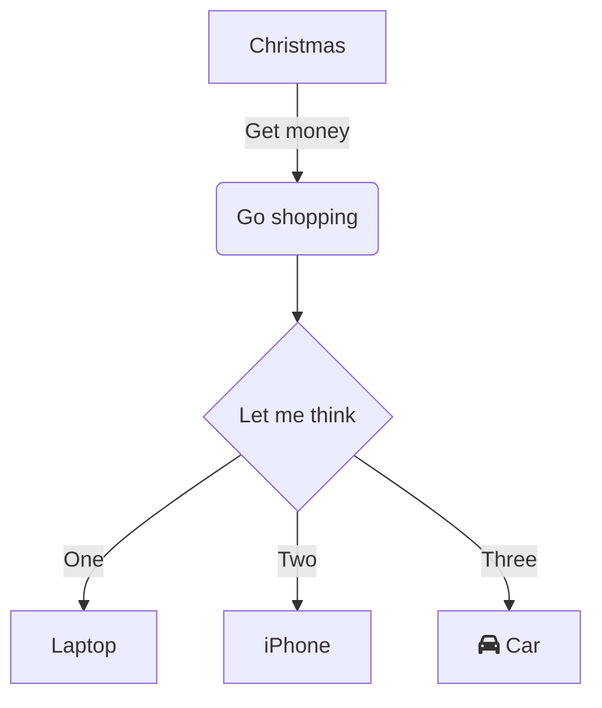

# GithubActionBebop :wrench:

This project helps better understand and interact with github actions in all their glory 

:coffee:

# Mermaid Js :smirk: 

I came across this fancy Gimick that allows you to draw diagrams directly on your readme. Pretty Cool :smirk: 

### Another one 

### Links 

* [Project](https://github.com/mermaid-js/mermaid#readme)
* [Online Editor](https://mermaid-js.github.io/mermaid-live-editor)
* [Documentation](https://mermaid-js.github.io/mermaid/#/)
